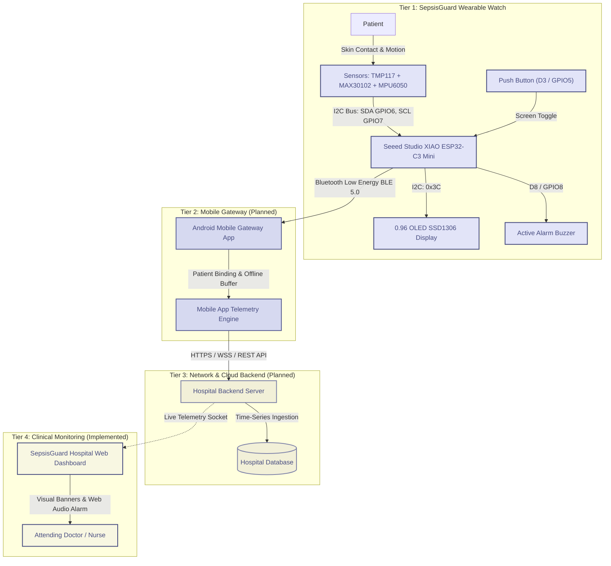
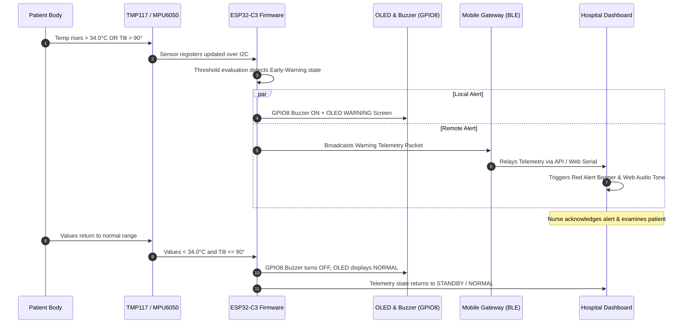
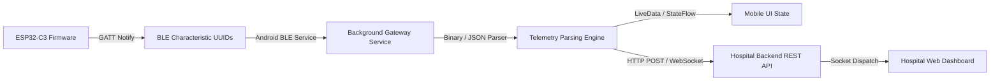
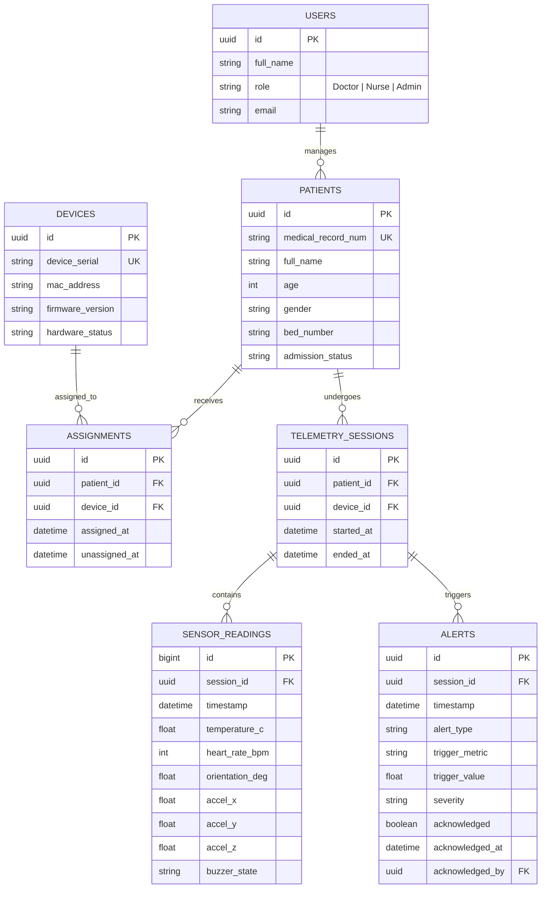

# SepsisGuard
> **IoT-Based Patient Early-Warning and Continuous Monitoring System**

[](https://www.seeedstudio.com/Seeed-XIAO-ESP32C3-p-5431.html)
[](https://developer.mozilla.org/en-US/docs/Web/API/Web_Serial_API)
[](https://developer.mozilla.org/en-US/docs/Web/JavaScript)
[](https://tailwindcss.com/)
[](LICENSE)
[]()

---

> [!IMPORTANT]
> **CLINICAL & MEDICAL DISCLAIMER**  
> **SepsisGuard is an early-warning monitoring system and is not a standalone medical diagnosis system.**  
> SepsisGuard is engineered to provide continuous patient monitoring, clinical attention support, and real-time patient risk indicators to assist healthcare personnel. It does not independently diagnose sepsis, septic shock, or any other medical condition. All alerts, thresholds, and sensor telemetry must be interpreted by qualified doctors, nurses, or clinical professionals in conjunction with standard diagnostic protocols.

---

## Table of Contents

1. [Project Overview](#1-project-overview)
2. [Problem Statement](#2-problem-statement)
3. [Solution](#3-solution)
4. [System Architecture](#4-system-architecture)
5. [Complete Data Flow](#5-complete-data-flow)
6. [Current Hardware Specifications](#6-current-hardware-specifications)
7. [Watch Features & UI Navigation](#7-watch-features--ui-navigation)
8. [Sensor Details](#8-sensor-details)
9. [Early-Warning Logic](#9-early-warning-logic)
10. [Mobile Application (Planned Production Architecture)](#10-mobile-application-planned-production-architecture)
11. [Mobile App Data Flow](#11-mobile-app-data-flow)
12. [Backend Architecture (Planned Production Architecture)](#12-backend-architecture-planned-production-architecture)
13. [Database Model (Planned Production Architecture)](#13-database-model-planned-production-architecture)
14. [Hospital Web Dashboard (Implemented)](#14-hospital-web-dashboard-implemented)
15. [Current Prototype Data Connection vs. Production Roadmap](#15-current-prototype-data-connection-vs-production-roadmap)
16. [Software Architecture & Repository Structure](#16-software-architecture--repository-structure)
17. [Quick Start & Local Setup](#17-quick-start--local-setup)
18. [Project Demonstration & Evaluation Guide](#18-project-demonstration--evaluation-guide)

---

## 1. Project Overview

**SepsisGuard** is an affordable, wearable IoT-based patient continuous monitoring and early-warning telemetry system. Engineered around low-power embedded computing and clinical-grade digital sensors, SepsisGuard continuously gathers physiological and positional data from a patient and delivers immediate telemetry and warnings to attending healthcare workers.

The central concept is an unobtrusive wearable watch worn by the patient that measures key vital trends without tethering the patient to bulky, expensive ICU equipment.

```
       [ Wearable Watch ]                           [ Central Monitoring ]
┌───────────────────────────────┐               ┌───────────────────────────────┐
│ • TMP117   (Body Temperature) │               │ • Live Vital Signs Dashboard  │
│ • MAX30102 (Heart Rate)       │ ── Telemetry ──▶ • Immediate Early-Warnings     │
│ • MPU6050  (Motion / Angle)   │               │ • Historical Trend Analysis   │
│ • OLED     (Local Display)    │               │ • Diagnostic Reports (CSV)    │
│ • Buzzer   (Local Alarm)      │               │ • Hardware Health Telemetry   │
└───────────────────────────────┘               └───────────────────────────────┘
```

### Monitored Parameters
- **Core / Skin Body Temperature** (high-precision digital measurement)
- **Real Heart Rate** (photoplethysmography optical sensing)
- **Patient Physical Movement** (3-axis acceleration and angular rate)
- **Patient Orientation & Posture** (computed tilt and roll angles for fall/distress detection)
- **Hardware & Sensor Health Status** (I2C bus integrity, connection state, sensor availability)
- **Early-Warning Conditions** (vital abnormalities crossing safety thresholds)

### Provided Capabilities
- **Real-Time Monitoring:** Sub-second telemetry visualization and vital updates.
- **Early-Warning Alerts:** Local auditory alarms and synchronized web dashboard alerts.
- **Historical Telemetry:** Stored chronological records with filtering and review.
- **Reporting Engine:** Statistical summaries (mean, min, max) and RFC 4180 CSV export.
- **Sensor Diagnostics:** Real-time health monitoring of each sensor connected to the bus.
- **Patient & Device State:** Complete hardware status, serial connection parameters, and patient metadata tracking.

---

## 2. Problem Statement

Sepsis is a life-threatening organ dysfunction caused by a dysregulated systemic host response to infection. According to global health statistics, sepsis is one of the leading causes of inpatient mortality in hospitals worldwide. Clinical outcomes are critically time-sensitive: **every hour of delay in identifying deterioration significantly increases mortality**.

Modern healthcare facilities face critical operational challenges:

1. **Intermittent Manual Monitoring:** In general hospital wards and step-down units, nurse rounds typically record vital signs only once every 4 to 6 hours. Sudden physiological deterioration occurring between rounds often goes unnoticed until the patient reaches an advanced, critical state.
2. **Delayed Detection of Abnormal Conditions:** Early clinical warning signs of systemic inflammation—such as subtle, persistent spikes in body temperature, acute tachycardia, or sudden unresponsiveness/fall—frequently develop gradually before precipitating into septic shock.
3. **High Equipment Costs:** Traditional multi-parameter patient monitoring units cost thousands of dollars per bed, restricting continuous surveillance primarily to Intensive Care Units (ICUs).
4. **Resource-Constrained Environments:** Rural hospitals, tier-2/3 medical centers, and overburdened post-operative wards lack the budget and nurse-to-patient ratios required for intensive continuous monitoring.
5. **Need for Accessible Interfaces:** Clinical staff require intuitive, zero-overhead visualization tools that deliver unambiguous alerts without overwhelming nurses with complex menu systems.

SepsisGuard directly bridges this gap by offering a continuous, non-invasive, low-cost wearable monitoring solution designed for early risk detection.

---

## 3. Solution

SepsisGuard provides an end-to-end telemetry pipeline combining wearable hardware, multi-parameter sensing, local edge decision-making, and centralized clinical visualization:

```
[ Patient Wears Watch ]
          │
          ▼
[ Continuous Sensor Data Acquisition (TMP117, MAX30102, MPU6050) ]
          │
          ▼
[ On-Chip Edge Evaluation & Local Buzzer Warning (ESP32-C3) ]
          │
          ▼
[ Wireless Telemetry Stream (BLE Gateway / Direct Serial Prototype) ]
          │
          ▼
[ Hospital Central Web Dashboard & Alarm Notification ]
          │
          ▼
[ Prompt Clinical Attention by Attending Doctors & Nurses ]
```

### Core Value Proposition
- **Continuous Vigilance:** Replaces 4-hour snapshot checks with continuous, 1-second interval telemetry.
- **Edge Warning:** Local buzzer and OLED warnings alert attending staff immediately, even if central network connectivity fluctuates.
- **Affordable Architecture:** Uses commodity off-the-shelf microcontrollers and standardized digital I2C sensors, reducing equipment costs by more than 90% compared to traditional bedside units.
- **Non-Invasive Wearable:** Lightweight watch form factor allows patients to sleep, move, and rest without uncomfortable medical harnesses.

---

## 4. System Architecture

### Conceptual Production Architecture



### Complete Alert Propagation Path



---

## 5. Complete Data Flow

The end-to-end data transmission and decision flow operates through thirteen well-defined steps:

```
 [Step 1]  Patient wears SepsisGuard watch on wrist/arm
    │
 [Step 2]  Sensors continuously capture physiological & motion signals
    │
 [Step 3]  ESP32-C3 reads I2C digital registers (TMP117, MAX30102, MPU6050)
    │
 [Step 4]  Firmware calculates temperatures, heart rate BPM, and posture angles
    │
 [Step 5]  ESP32 evaluates local early-warning conditions against safety thresholds
    │
 [Step 6]  If warning condition met, local buzzer (GPIO8) immediately pulses
    │
 [Step 7]  ESP32 formats and transmits telemetry payload (BLE in prod / Serial in dev)
    │
 [Step 8]  Android mobile application receives telemetry stream via BLE
    │
 [Step 9]  Mobile application serves as local bedside gateway and cache
    │
 [Step 10] Mobile app forwards encrypted telemetry over Wi-Fi / LTE to hospital server
    │
 [Step 11] Backend processes, validates, and stores telemetry in time-series database
    │
 [Step 12] Hospital Web Dashboard renders live vitals, graphs, and hardware health
    │
 [Step 13] If alert triggered, dashboard sounds audio tone and logs timestamped event
```

1. **Step 1 — Sensor Placement:** The patient wears the SepsisGuard watch. The TMP117 thermal probe and MAX30102 optical sensor maintain steady skin contact, while the MPU6050 aligns with the patient's forearm.
2. **Step 2 — Continuous Signal Capture:** Photodiodes, thermopiles, and micro-electromechanical (MEMS) accelerometers sample physiological metrics continuously.
3. **Step 3 — I2C Register Reading:** The ESP32-C3 microcontroller initiates periodic I2C master read transactions over GPIO6 (SDA) and GPIO7 (SCL).
4. **Step 4 — Telemetry Calculation:** Firmware calculates calibrated Celsius temperatures, pulse rate in Beats Per Minute (BPM), and spatial tilt angles (Pitch/Roll).
5. **Step 5 — Threshold Verification:** The embedded logic cross-references current readings with hardcoded safety boundaries.
6. **Step 6 — Edge Actuation:** Upon threshold breach, the firmware triggers GPIO8 high to activate the onboard buzzer and renders high-contrast alert symbols on the SSD1306 OLED.
7. **Step 7 — Wireless/Serial Dispatch:** Telemetry packets are formatted into structured cycles and dispatched via BLE GATT characteristics (production) or USB Serial stream (prototype).
8. **Step 8 — Mobile Ingestion:** The bedside Android mobile gateway captures the BLE broadcast without requiring patient interaction.
9. **Step 9 — Gateway Processing:** The mobile gateway attaches patient identification (Patient ID, Bed Number) and performs local validation.
10. **Step 10 — Cloud/LAN Transmission:** The mobile app transmits telemetry packets over hospital Wi-Fi or cellular data via REST/WebSocket endpoints.
11. **Step 11 — Backend Ingestion:** The hospital backend verifies data integrity, archives records in the database, and flags anomalies.
12. **Step 12 — Ward Dashboard Rendering:** The SepsisGuard web interface updates patient cards, sparklines, and status badges in real time.
13. **Step 13 — Alarm Logging & Notification:** Central auditory alarms sound, active alert badges illuminate, and an audit trail entry is committed to the alert ledger for clinical review.

---

## 6. Current Hardware Specifications

SepsisGuard utilizes the ultra-compact, high-efficiency **Seeed Studio XIAO ESP32-C3 Mini** board paired with dedicated I2C breakout modules.

```
                  ┌─────────────────────────────────────────┐
                  │    Seeed Studio XIAO ESP32-C3 Mini      │
                  │   32-bit RISC-V @ 160MHz | 400KB SRAM   │
                  │       2.4 GHz Wi-Fi & BLE 5.0           │
                  └────┬───────────┬───────────┬─────────┬──┘
                       │           │           │         │
                 3.3V / GND       D4          D5        D8      D3
                     │          (GPIO6)     (GPIO7)   (GPIO8) (GPIO5)
                     │             │           │         │       │
    ┌────────────────┴──────┐     SDA         SCL     Positive   │
    │ All Sensor Modules    │      │           │         │       │
    │ • TMP117 (0x48)       ├──────┴───────────┤         ▼       ▼
    │ • MAX30102 (0x57)     │                  │      [Buzzer] [Button]
    │ • MPU6050 (0x68)      │                  │       Alarm    Screen
    │ • SSD1306 OLED (0x3C) │                  │       Output   Toggle
    └───────────────────────┘                  │
```

### Complete Pin Assignment Table

| Pin Label | ESP32-C3 GPIO | Hardware Function | Connected Component | Signal Type | Logic Level |
|:---|:---|:---|:---|:---|:---|
| **D4** | **GPIO6** | I2C Data Line (SDA) | TMP117, MAX30102, MPU6050, SSD1306 | Digital Bidirectional | 3.3V |
| **D5** | **GPIO7** | I2C Clock Line (SCL) | TMP117, MAX30102, MPU6050, SSD1306 | Digital Output | 3.3V |
| **D8** | **GPIO8** | Local Warning Buzzer | Active Piezo Buzzer Transducer | Digital Output | 3.3V |
| **D3** | **GPIO5** | Navigation Button | Tactile Push Button (Pull-Up) | Digital Input | Active LOW |
| **3V3** | 3.3V Rail | System Power Supply | VCC pins of all peripheral modules | DC Power | 3.3V |
| **GND** | Ground | Common Reference | GND pins of all peripheral modules | DC Ground | 0V |

> [!CAUTION]
> **GPIO PINOUT CLARIFICATION**  
> Legacy microcontrollers frequently map buzzers to GPIO25. **The actual SepsisGuard hardware uses GPIO8 (Pin D8)** on the Seeed Studio XIAO ESP32-C3 Mini. Do not configure GPIO25 in firmware or schematics.

### I2C Bus Address Map

| Device Description | Component | 7-Bit Hex Address | Bus Role | Notes |
|:---|:---|:---|:---|:---|
| High-Precision Temperature Sensor | **TMP117** | `0x48` | Target Device | ADD0 connected to GND |
| Pulse Oximetry & Heart Rate Sensor | **MAX30102** | `0x57` | Target Device | Factory hardcoded I2C address |
| 6-Axis Motion & IMU Sensor | **MPU6050** | `0x68` | Target Device | AD0 connected to GND |
| 0.96" 128x64 Monochrome OLED | **SSD1306** | `0x3C` | Target Device | Standard I2C display address |

---

## 7. Watch Features & UI Navigation

The wearable SepsisGuard watch combines autonomous edge intelligence with simple, tactile local navigation for the patient and bedside nurses:

- **Continuous Temperature Monitoring:** Rapid response digital thermal sensing with 0.0078°C resolution.
- **Heart-Rate Detection:** Optical reflective sensor calculating real-time BPM.
- **Motion & Inactivity Tracking:** 3-axis accelerometer measuring gross motor activity and restless episodes.
- **Posture & Orientation Awareness:** Gyroscopic and gravitational vector tracking to determine if the patient is supine, sitting upright, tilted abnormally, or has fallen.
- **Local SSD1306 OLED Display:** Clear, high-contrast monochrome display showing live numbers without needing a computer screen.
- **Tactile Push Button Navigation:** Single-click cycling between dedicated information screens.
- **Auditory Edge Buzzer Alert:** Instant sound alarm upon vital threshold breach.
- **Real-Time Sensor Bus Health:** Self-diagnostic polling showing connected/disconnected flags for every peripheral.
- **Battery-Operated Wearable:** Low-power sleep modes and lightweight 3.3V lithium polymer (LiPo) compatibility.

### OLED Screen Navigation Cycle

A tactile push button connected to **D3 / GPIO5** allows nurses or patients to cycle through four display screens:

```
[ Push Button Click ]
         │
         ├──▶ Screen 1: Temperature View (TMP117 live °C, safety status)
         │
         ├──▶ Screen 2: Heart Rate View (MAX30102 live BPM, finger detect)
         │
         ├──▶ Screen 3: Orientation View (MPU6050 pitch/roll angle, posture)
         │
         └──▶ Screen 4: Sensor Diagnostics View (TMP, MAX, MPU, I2C bus OK/ERR)
```

```
┌────────────────────┐  ┌────────────────────┐  ┌────────────────────┐  ┌────────────────────┐
│ SEPSISGUARD  [TEMP]│  │ SEPSISGUARD   [HR] │  │ SEPSISGUARD [TILT] │  │ SENSOR DIAGNOSTICS │
│                    │  │                    │  │                    │  │ TMP117:  ONLINE    │
│    34.25 °C        │  │     74 BPM         │  │     18.50 DEG      │  │ MAX30102:ONLINE    │
│ STATUS: NORMAL     │  │ FINGER DETECTED    │  │ POSTURE: SUPINE    │  │ MPU6050: ONLINE    │
└────────────────────┘  └────────────────────┘  └────────────────────┘  └────────────────────┘
       Screen 1                Screen 2                Screen 3                Screen 4
     Temperature              Heart Rate             Orientation            Sensor Status
```

---

## 8. Sensor Details

| Sensor | Primary Purpose | Interface | I2C Address | Operating Range | Clinical Significance in Sepsis |
|:---|:---|:---:|:---:|:---|:---|
| **TMP117** | Body Core/Skin Temperature | I2C | `0x48` | -55°C to +150°C (±0.1°C accuracy) | Detects hypothermia (<36°C) or hyperthermia (>38°C), primary systemic inflammatory markers. |
| **MAX30102** | Photoplethysmography Heart Rate | I2C | `0x57` | Optical red/IR reflective LEDs | Identifies persistent tachycardia (>90 BPM), an early physiological response to infection. |
| **MPU6050** | 6-Axis Motion & Orientation | I2C | `0x68` | ±2g to ±16g, ±250°/s to ±2000°/s | Detects sudden patient falls, prolonged immobility, or acute physical agitation/tremors. |
| **SSD1306** | Local Watch Display | I2C | `0x3C` | 128×64 Monochrome Graphic | Provides instant bedside vital feedback to visiting nurses without waiting for workstation access. |

### Technical Sensor Descriptions
- **TMP117:** A high-precision digital temperature sensor meeting ASTM E1112 and ISO 80601 clinical temperature specifications. It features integrated 16-bit analog-to-digital conversion, eliminating calibration drift and analog noise associated with analog thermistors.
- **MAX30102:** An integrated pulse oximetry and heart-rate monitor biosensor module. It combines two optical LEDs (red and infrared), a photodetector, optical elements, and low-noise analog processing to measure arterial blood volume pulsations.
- **MPU6050:** Combines a 3-axis MEMS accelerometer and 3-axis MEMS gyroscope on the same silicon die. Used by SepsisGuard's embedded orientation engine to resolve tilt angle relative to gravity, distinguishing normal bed rest from abnormal angles or sudden falls.
- **SSD1306:** An ultra-low-power OLED display controller driven over I2C. Pixels emit light directly without a backlight, ensuring battery efficiency and clear legibility in darkened patient rooms.

---

## 9. Early-Warning Logic

> [!NOTE]
> **PROTOTYPE THRESHOLD CALIBRATION**  
> The thresholds below represent **project-defined testing limits** calibrated for demonstration and laboratory prototyping. In formal clinical hospital settings, thresholds are tuned to standard clinical evaluation frameworks such as the **National Early Warning Score 2 (NEWS2)**, **Systemic Inflammatory Response Syndrome (SIRS)** criteria, or **quick SOFA (qSOFA)**.

### Current Prototype Alert Conditions

A warning state is triggered when **either** of the following conditions evaluates to true:

$$\text{Temperature} > 34.0\,^\circ\text{C} \quad\lor\quad |\text{Orientation Angle}| > 90.0^\circ$$

```
                           ┌─────────────────────────┐
                           │   Read Sensor Values    │
                           └────────────┬────────────┘
                                        │
                         ┌──────────────┴──────────────┐
                         ▼                             ▼
                 Temperature Value             Orientation Angle
                         │                             │
                   Is Temp > 34.0°C?           Is |Angle| > 90°?
                         │                             │
                         ├──────────────┬──────────────┤
                                        │
                                  [ YES to EITHER ]
                                        │
                         ┌──────────────┴──────────────┐
                         ▼                             ▼
                 [ NORMAL STATE ]              [ WARNING STATE ]
                 • Buzzer: OFF                 • Buzzer (GPIO8): ON
                 • OLED: Normal Text           • OLED: "WARNING" Banner
                 • Dashboard: Green / Safe     • Dashboard: Red Alert + Audio
                 • Ledger: Normal Log          • Ledger: Incident Timestamped
```

### State Transitions
1. **Triggering Phase:** When temperature exceeds $34.0\,^\circ\text{C}$ or orientation angle exceeds $90^\circ$:
   - The ESP32 firmware immediately sets GPIO8 high, activating the physical buzzer.
   - The SSD1306 OLED updates its screen with visual warning alerts.
   - The Web Dashboard renders an active red alert banner, displays the triggering value, and sounds an 880 Hz / 1200 Hz clinical tone via Web Audio.
   - An alert event is permanently recorded in the local alert history with an exact millisecond timestamp.
2. **Restoration Phase:** Once temperature drops to or below $34.0\,^\circ\text{C}$ and orientation normalizes ($\le 90^\circ$):
   - The ESP32 turns off GPIO8, silencing the buzzer.
   - The OLED returns to standard telemetry views.
   - The Web Dashboard returns to normal standby monitoring and marks the incident as resolved.

---

## 10. Mobile Application (Planned Production Architecture)

> [!NOTE]
> **ROADMAP ARCHITECTURE**  
> The Android Mobile Application described in this section represents the **planned production architecture**. It is currently being designed and is not yet implemented in the repository codebase.

In the production deployment, the patient cannot remain tethered to a workstation via USB. An Android mobile gateway acts as an untethered, wireless relay bridging the SepsisGuard watch to hospital servers.

```
┌──────────────────────┐         BLE 5.0         ┌──────────────────────┐        Wi-Fi / LTE       ┌──────────────────────┐
│  SepsisGuard Watch   │ ──────────────────────▶ │    Android Mobile    │ ───────────────────────▶ │   Hospital Backend   │
│     (ESP32-C3)       │      (Encrypted)        │     Gateway App      │       (HTTPS/WSS)        │      & Database      │
└──────────────────────┘                         └──────────────────────┘                          └──────────────────────┘
```

### Planned Mobile Application Capabilities

#### BLE Connection Management
- **Automatic Device Discovery:** Scans for local `SepsisGuard-Node` BLE advertisements.
- **Secure Pairing:** Secure passkey or NFC-tap pairing between the watch and bedside tablet/phone.
- **Auto-Reconnection:** Background watchdog service immediately reconnects if the patient walks out of range and returns.
- **Signal Quality Metrics:** Live Received Signal Strength Indicator (RSSI) display to verify link stability.

#### Live Bedside Monitoring
- Continuous display of real-time temperature, heart rate, orientation angle, and physical motion.
- Device battery charge level indicator and charging state.
- Sensor hardware health status indicators.

#### Patient Metadata Association
- Input fields for Patient ID, Full Name, Assigned Ward, Bed Number, and Attending Physician.
- Binding between unique ESP32 Bluetooth MAC address and Patient Medical Record Number (MRN).

#### Alert Processing & Local Notifications
- High-priority Android heads-up notifications when threshold violations occur.
- Visual breakdown of triggering parameter (e.g., `TRIGGER: Temperature 34.4°C > 34.0°C`).
- Nurse alert acknowledgment button logging the responding staff member's ID.

#### Telemetry Cache & History
- Offline SQLite buffer storing telemetry points during hospital Wi-Fi dropouts.
- Automatic backfilling to the hospital database once Wi-Fi re-establishes.
- 24-hour bedside vital sign trend graphs.

---

## 11. Mobile App Data Flow



1. **BLE Characteristic Emission:** The ESP32-C3 acts as a BLE Peripheral (GATT Server), publishing sensor records as structured binary notifications across custom GATT Characteristics (e.g., `UUID_TEMP`, `UUID_HEARTRATE`, `UUID_MOTION`).
2. **Android Foreground Service:** An Android Foreground Service runs continuously with a persistent notification to prevent the Android OS from killing the BLE connection.
3. **Telemetry Decoding:** The mobile parser validates packet checksums, converts raw byte arrays into IEEE floating-point numbers, and creates a timestamped telemetry object.
4. **Local State & Cache:** The record updates local UI state observers and appends to an internal SQLite/Room database.
5. **Relay to Backend:** The mobile gateway batches or streams telemetry to the central hospital server via encrypted HTTPS POST or persistent WebSocket channels.

---

## 12. Backend Architecture (Planned Production Architecture)

> [!NOTE]
> **ROADMAP ARCHITECTURE**  
> The backend server infrastructure described in this section represents the **planned production architecture**.

```
┌──────────────────────┐         REST / WSS       ┌────────────────────────────────────────────────────────┐
│ Android Mobile Apps  │ ───────────────────────▶ │               Hospital Backend Service                 │
└──────────────────────┘                          │  ┌───────────────┐ ┌───────────────┐ ┌───────────────┐  │
                                                  │  │ Auth & RBAC   │ │ Ingestion Svc │ │ Alert Engine  │  │
┌──────────────────────┐         WebSockets       │  └───────────────┘ └───────────────┘ └───────────────┘  │
│ Hospital Dashboards  │ ◀─────────────────────── │  ┌───────────────┐ ┌───────────────┐ ┌───────────────┐  │
└──────────────────────┘                          │  │ Patient Mgmt  │ │ Reporting Svc │ │ Device Health │  │
                                                  │  └───────────────┘ └───────────────┘ └───────────────┘  │
                                                  └───────────────────────────┬────────────────────────────┘
                                                                              │
                                                                              ▼
                                                                ┌───────────────────────────┐
                                                                │  Relational / Time-Series │
                                                                │         Database          │
                                                                └───────────────────────────┘
```

### Backend Responsibilities
- **Authentication & RBAC:** Role-based access control protecting patient health information (HIPAA/GDPR compliance).
- **Patient Management:** CRUD operations for patient admission, discharge, and bed assignment.
- **Device Provisioning:** Inventory registry for SepsisGuard watches, serial numbers, and calibration dates.
- **Telemetry Ingestion:** High-throughput ingestion API capable of handling hundreds of concurrent wearable streams.
- **Alert Dispatch Engine:** Multi-channel alerting (central dashboard sockets, SMS pager, nurse station push notifications).
- **Long-Term Storage:** Archiving vital sign histories for medical research and clinical audits.
- **Reporting & Analytics:** Automated daily patient progress reports and ward-level vital summaries.

---

## 13. Database Model (Planned Production Architecture)

*Database technology can be selected during backend implementation (e.g., PostgreSQL with TimescaleDB extension, MongoDB, or Supabase).*



---

## 14. Hospital Web Dashboard (Implemented)

The SepsisGuard project features a fully functional, high-density hospital telemetry web application located in the repository root. Built with responsive layout tokens and medical workstation ergonomics, the dashboard provides six comprehensive views:

```
┌────────────────────────────────────────────────────────────────────────────────────────────────────────┐
│  SEPSISGUARD PATIENT IOT TELEMETRY                 [NODE-01] [COM3 ESP32] [115200 BAUD] [10:48:00 AM]  │
├──────────────┬─────────────────────────────────────────────────────────────────────────────────────────┤
│ [Dashboard]  │  ┌─────────────────┐ ┌─────────────────┐ ┌─────────────────┐ ┌─────────────────┐       │
│ [History]    │  │ TEMPERATURE     │ │ HEART RATE      │ │ ORIENTATION     │ │ MOTION VECTOR   │       │
│ [Reports]    │  │   34.20 °C      │ │   74 BPM        │ │   15.20 DEG     │ │   0.98 G (Z)    │       │
│ [Sensors]    │  │  [SPARKLINE]    │ │  [SPARKLINE]    │ │  [SPARKLINE]    │ │  [SPARKLINE]    │       │
│ [Alerts]     │  └─────────────────┘ └─────────────────┘ └─────────────────┘ └─────────────────┘       │
│ [Settings]   │  ┌──────────────────────────────────────────────┐ ┌───────────────────────────────────┐  │
│              │  │ Real-Time Vital Telemetry Charts             │ │ Live Hardware Serial Stream       │  │
│              │  │ (Canvas-rendered dynamic time-series curves) │ │ Temperature: 34.20 C              │  │
│              │  │                                              │ │ Heart Rate: 74 BPM                │  │
│              │  └──────────────────────────────────────────────┘ └───────────────────────────────────┘  │
└──────────────┴─────────────────────────────────────────────────────────────────────────────────────────┘
```

### Implemented Views & Feature Breakdown

#### 1. Dashboard View (`#dashboard`)
- **Real-Time Vital Cards:** High-visibility digital readouts for Temperature (°C), Heart Rate (BPM), Orientation/Tilt (°), and Motion Vector ($G$).
- **Dynamic Micro-Sparklines:** Responsive SVG sparkline graphs embedded directly in each card showing rolling 20-point trend trajectories.
- **Hardware Telemetry Terminal:** Embedded live serial console displaying raw text lines received directly from the ESP32.
- **System Status Indicators:** Visual health badges for Web Serial connectivity, ESP32 status, and buzzer activation.
- **Web Audio Alert Engine:** Built-in dual-frequency audio synthesizer (880 Hz / 1200 Hz square wave) providing bedside sound alerts matching the watch buzzer.

#### 2. History View (`#history`)
- **Filterable Telemetry Table:** Complete tabular history of recorded vital cycles.
- **Time & Metric Search:** Filter records by timestamp, alert state, or sensor status.
- **Pagination & Density Controls:** Customizable view limit (50, 100, 250, 500 records) with local browser persistence.

#### 3. Reports View (`#reports`)
- **Statistical Analytics:** Automated calculations for Mean, Minimum, Maximum, and Standard Deviation across all recorded vitals.
- **RFC 4180 CSV Exporter:** Instant client-side CSV report generation:
  - Complete Telemetry Logs (`sepsisguard_complete_telemetry.csv`)
  - Temperature Logs (`sepsisguard_temperature_log.csv`)
  - Heart Rate Logs (`sepsisguard_heartrate_log.csv`)
  - Orientation Logs (`sepsisguard_orientation_log.csv`)
- **Printable Clinical Summary:** Formatted summaries designed for handover review between shifts.

#### 4. Sensors View (`#sensors`)
- **Hardware Component Diagnostics:** Individual health cards for:
  - `TMP117` Temperature Sensor
  - `MAX30102` Optical Biosensor
  - `MPU6050` 6-Axis Motion IMU
  - `SSD1306` 0.96" OLED Screen
  - `Active Buzzer` Transducer (GPIO8)
  - `Seeed XIAO ESP32-C3` Microcontroller
- **I2C Bus Diagnostics:** Real-time indicator of I2C bus traffic, error counters, and address verification.
- **Pin Assignment Reference:** Built-in hardware wiring reference table.

#### 5. Alerts View (`#alerts`)
- **Active Warning Banner:** High-priority visual alert indicating triggering parameter and breach time.
- **Clinical Acknowledgment Workflow:** Allows nurses to mark alerts as acknowledged, recording acknowledgment timestamp and user notes.
- **Historical Alert Ledger:** Complete log of all historical early-warning events with trigger values and duration.

#### 6. Settings View (`#settings`)
- **Web Serial Port Manager:** Port selection and baud rate configuration (`9600`, `57600`, `115200`).
- **Threshold Calibration:** Adjustable monitoring thresholds for Temperature and Orientation.
- **Offline Hardware Simulator:** Built-in simulation toggle allowing testing without physical hardware:
  - Toggle High Temperature Alert simulation (34.20°C)
  - Toggle Abnormal Orientation simulation (95.0°)
  - Toggle MAX30102 Heart Rate simulation (74 BPM)
- **Data Management:** Local data clearing and settings reset tools.

---

## 15. Current Prototype Data Connection vs. Production Roadmap

To ensure technical transparency and academic rigor, the distinction between what is currently operational in the repository and what is planned for future phases is summarized below:

```
┌────────────────────────────────────────────────────────────────────────────────────────┐
│ CURRENT WORKING PROTOTYPE (Implemented in Repository)                                 │
│                                                                                        │
│   [ESP32-C3 Watch] ──── USB Cable (115200 Baud) ───▶ [Web Serial API] ───▶ [Dashboard]│
│                                                                                        │
│   • Direct USB-to-UART connection via browser Web Serial API.                         │
│   • Sub-second latency, zero intermediate network configuration.                       │
│   • Built-in software simulation engine for offline testing.                           │
└────────────────────────────────────────────────────────────────────────────────────────┘

                                         VS

┌────────────────────────────────────────────────────────────────────────────────────────┐
│ PLANNED PRODUCTION ARCHITECTURE (Future Production Roadmap)                            │
│                                                                                        │
│   [ESP32-C3 Watch] ── BLE 5.0 ──▶ [Android Gateway] ── Wi-Fi/LTE ──▶ [Backend] ──▶ [Web]│
│                                                                                        │
│   • Untethered patient mobility using Bluetooth Low Energy.                            │
│   • Android smartphone/tablet serves as bedside network gateway.                       │
│   • Central multi-patient database and hospital ward dashboard.                        │
└────────────────────────────────────────────────────────────────────────────────────────┘
```

### Detailed Comparison Table

| Feature Dimension | Current Implemented Prototype | Planned Production Roadmap |
|:---|:---|:---|
| **Physical Connection** | USB Type-C Cable | Wireless (Wearable Battery-Operated) |
| **Communication Protocol** | USB Serial via Web Serial API | Bluetooth Low Energy 5.0 (BLE GATT) |
| **Baud Rate / PHY** | `115200` Baud, 8-N-1 | 1 Mbps / 2 Mbps BLE Coded PHY |
| **Host Interface** | Browser-native `navigator.serial` | Android BLE Background Service |
| **Network Relaying** | Local workstation host | Cellular 4G/5G or Hospital Wi-Fi |
| **Backend & Storage** | Local browser `localStorage` + Memory | Cloud/On-Premise REST API + Database |
| **Patient Scope** | Single bedside monitoring station | Multi-patient hospital ward scale |
| **Simulation Mode** | Implemented directly in `serial.js` | Cloud-based mock device fleet |

---

## 16. Software Architecture & Repository Structure

### Directory Structure

```text
SepsisGuard/
├── css/
│   └── style.css            # Custom CSS animations, layout tokens, and utilities
├── js/
│   ├── app.js               # Main controller: UI init, tabs, audio tone, clock
│   ├── charts.js            # Canvas-based high-performance vital trend renderer
│   ├── parser.js            # Serial stream parser & state transition detector
│   ├── reports.js           # RFC 4180 CSV export engine and statistical summaries
│   ├── serial.js            # Web Serial API driver & offline hardware simulator
│   └── state.js             # Centralized application store & localStorage persistence
├── index.html               # Main dashboard single-page application (SPA)
├── server.js                # Lightweight local development HTTP server (Node.js)
└── README.md                # Project documentation and engineering manual
```

### Software Component Descriptions

- **`index.html`:** The primary single-page application interface. Configured with a dedicated clinical theme (Tailwind tokens via CDN + Space Grotesk / JetBrains Mono typography) and semantic layouts for all six views.
- **`server.js`:** Zero-dependency native Node.js HTTP server configured to serve project files over `http://127.0.0.1:3000/`.
- **`js/parser.js` (`ESP32Parser`):** Stream processor that handles raw character buffers received over Web Serial, splits streams into lines, and parses telemetry tokens using regular expressions:
  - `Temperature: <float> C` $\rightarrow$ TMP117 reading
  - `Heart Rate: <int> BPM` $\rightarrow$ MAX30102 reading
  - `Orientation: <float>` / `Pitch: <float> Roll: <float>` $\rightarrow$ MPU6050 reading
  - `Accel: X:<f>, Y:<f>, Z:<f>` $\rightarrow$ 3-axis motion components
  - `BUZZER: ON - <reason>` / `BUZZER: OFF` $\rightarrow$ Hardware alarm state
  - `=====` $\rightarrow$ End-of-cycle delimiter emitting an atomic telemetry cycle
- **`js/serial.js` (`SerialManager`):** Manages serial streams via the Web Serial API (`navigator.serial`). Features an integrated offline simulator that emits realistic serial cycles when hardware is disconnected.
- **`js/state.js`:** Reactive centralized state store. Maintains current vitals, rolling history buffers (up to 1,000 points), alert logs, and threshold settings with automatic `localStorage` synchronization.
- **`js/charts.js` (`TelemetryCharts`):** Canvas-based rendering engine providing sparklines and rolling telemetry graphs.
- **`js/reports.js` (`ReportsEngine`):** Client-side reporting engine that calculates clinical summary statistics and triggers RFC 4180 CSV downloads.
- **`js/app.js`:** Main application controller. Initializes modules, manages tab navigation, coordinates the Web Audio alert buzzer synthesizer, and wires up UI event listeners.

### Serial Protocol Format

The ESP32 firmware transmits clean, human-readable ASCII cycles separated by delimiter lines at `115200` baud:

```text
===== TELEMETRY CYCLE =====
Temperature: 34.25 C
Heart Rate: 74 BPM
Orientation: 18.50 deg
Pitch: 18.50 Roll: -3.20
Accel: X: 0.05, Y: 0.02, Z: 0.98 g
Gyro: X: 0.10, Y: -0.20, Z: 0.00 deg/s
OLED: READY
BUZZER: ON - HIGH TEMPERATURE
===========================
```

---

## 17. Quick Start & Local Setup

### Prerequisites
- Modern web browser supporting the **Web Serial API** (Google Chrome, Microsoft Edge, Opera, or Brave).
- **Node.js** (v14+ recommended) for running the local server, or any standard static file server.
- *(Optional for Hardware)* Seeed Studio XIAO ESP32-C3 Mini connected via USB-C.

### Running the Web Dashboard

1. **Clone or Navigate to the Repository:**
   ```bash
   cd D:/SepsisGuard
   ```

2. **Start the Local Development Server:**
   ```bash
   node server.js
   ```
   *Expected console output:*
   ```text
   SepsisGuard server running at http://127.0.0.1:3000/
   ```

3. **Open the Dashboard in your Browser:**
   Navigate to [http://127.0.0.1:3000/](http://127.0.0.1:3000/)

### Connecting Hardware via Web Serial

1. Plug the **Seeed Studio XIAO ESP32-C3** into your computer using a USB-C data cable.
2. In the SepsisGuard dashboard, click the **Connect Device** button in the header or visit **Settings**.
3. Select your serial port (e.g., `COM3`, `COM4`, or `/dev/ttyUSB0`) and choose `115200` baud.
4. Click **Connect**. Live telemetry from the watch will begin streaming immediately into the dashboard.

### Testing in Offline Simulation Mode

If physical hardware is not plugged in, you can test all features using the built-in simulator:
1. Open the dashboard and navigate to **Settings**.
2. Under **Hardware Simulation Mode**, click **Enable Simulator**.
3. Toggle test scenarios:
   - *High Temperature Alert* (simulates temperature rising above 34.0°C)
   - *Abnormal Orientation* (simulates posture angle exceeding 90°)
   - *Heart Rate Stream* (simulates live MAX30102 pulse signal)
4. Observe the live dashboard cards, buzzer state transitions, and audio alarm responses.

---

## 18. Project Demonstration & Evaluation Guide

This guide is prepared for academic evaluators, project reviewers, and technical interviewers:

```
┌────────────────────────────────────────────────────────────────────────────────────────┐
│                            EVALUATION DEMO CHECKLIST                                   │
├────┬─────────────────────────────┬─────────────────────────────────────────────────────┤
│ 1. │ Real-Time Telemetry         │ Verify live vital updates on Dashboard view.        │
│ 2. │ Threshold Early-Warning     │ Trigger Temp > 34.0°C or Tilt > 90° to test buzzer. │
│ 3. │ Push Button Screen Cycling  │ Cycle watch OLED across all 4 display screens.       │
│ 4. │ Web Audio Tone Sync         │ Confirm browser alarm tone plays during alert.       │
│ 5. │ Alert Acknowledgment        │ Acknowledge alert in Alerts view & verify logging.  │
│ 6. │ Filterable History          │ Review historical telemetry records with filters.    │
│ 7. │ CSV Data Export             │ Generate & download an RFC 4180 CSV telemetry file. │
│ 8. │ Sensor Health Monitoring    │ Check Sensors view for real-time I2C bus health.     │
└────┴─────────────────────────────┴─────────────────────────────────────────────────────┘
```

### Key Technical Talking Points
- **Low-Cost Distributed Edge Intelligence:** The system does not rely on cloud computing to make time-critical safety decisions. If connectivity fails, the ESP32-C3 watch still evaluates sensor thresholds and triggers its local buzzer on GPIO8.
- **Accurate I2C Bus Arbitration:** Four distinct peripheral ICs (`0x48`, `0x57`, `0x68`, `0x3C`) coexist smoothly on a single shared 2-wire bus (SDA GPIO6, SCL GPIO7) using standard 3.3V logic.
- **Strict Clinical Scope:** Clearly emphasizes that SepsisGuard is an early-warning risk indicator and clinical attention support tool, not an automated diagnostic system.

---

## License

This project is licensed under the **MIT License** — see the [LICENSE](LICENSE) file for full details.

---

## Acknowledgments & References

- **World Health Organization (WHO):** Global report on the epidemiology and burden of sepsis.
- **Society of Critical Care Medicine (SCCM):** Surviving Sepsis Campaign International Guidelines.
- **Seeed Studio:** XIAO ESP32-C3 hardware documentation and pinout architecture.
- **Texas Instruments:** TMP117 high-precision digital temperature sensor datasheet.
- **Analog Devices / Maxim Integrated:** MAX30102 pulse oximeter biosensor operational manual.
- **InvenSense / TDK:** MPU-6050 six-axis motion tracking sensor specification.
